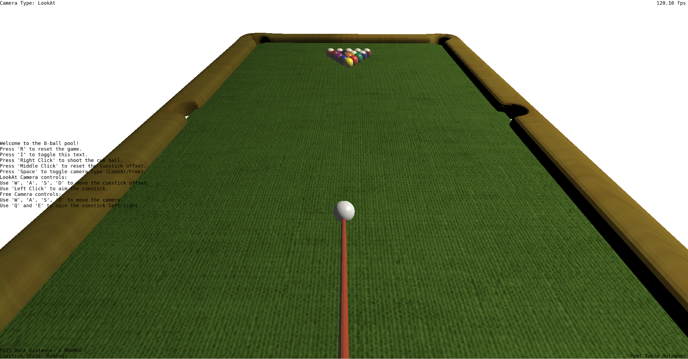
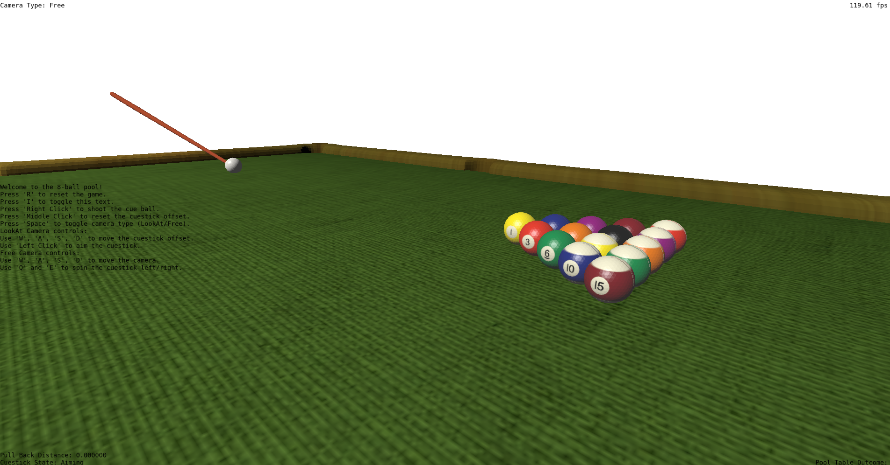

# Trabalho Final INF01047 - Fundamentos de Computação Gráfica

# 8-bol-pul

Ian Kersz Amaral - 00338368

Tomás Mitsuo Dias Ueda - 00344595

## DESCRIÇÃO DO JOGO 

simulador de sinuca 3D

## Contribuições de Cada Integrante

Os requisitos exigidos no trabalho foram separados entre os integrantes, de maneira que a
sua implementação foi realizada tanto em sessões síncrona, desenvolvendo em vídeo-chamada,
quanto assíncrona.

Cada membro ficou responsável pelos seguintes tópicos:

### Ian Kersz Amaral:
- Implementação da Free Camera
- Testes de Intersecção entre objetos
- Animação
- Curvas de Bézier
- Animação

### Tomás Mitsuo Dias Ueda:
- Organização inicial da estrutura do projeto
- Instanciação das Malhas Poligonais
- Criação das classes dos diferentes objetos
- Modelos de Iluminação
- Mapeamento de Texturas
- Implementação da Câmera Look-At

## Uso de IAs

A IA foi utilizada para auxiliar no mapeamento da textura da Mesa e para resolver problemas relacionados a colisão do taco com a bola branca.

## Uso dos conceitos da disciplina

### Câmera

Foram implementados 2 tipos de câmera diferentes:

- Câmera Look-At apontado para a bola branca
    
- Câmera Livre
    

### Transformações Geométricas

Bolas:
- Translação: Movimentação das bolas no espaço do jogo
- Rotação: Rotação das bolas para dar um realismo maior enquanto elas se movimentam

Taco:
- Translação: Realizado a translação do taco para permanecer em conjunto com a bola branca e tambem para modificar a posição dele em relação a bola, como subir ou abaixar, além de bater na bola de canto
- Rotação: A rotação sobre dois eixos foi utilizada para colocar o taco em um angulo não horizontal a mesa e tambem para rotaciona-lo em volta da bola

O usuario controla diretamente as transformações no Taco para efetuar as mecanicas do jogo.

Mesa:
- Translação: A mesa foi trasladada para se adequar melhor o modelo para o sistema de coordenadas global.

### Iluminação

Taco e Bolas:

- Para esses dois objetos foram implementados a interpolação de Phong e Iluminação de Blinn-Phong

Mesa:
- Para a mesa foi implementada a interpolação de Gouraud e a iluminação difusa (Lambert)

### Colisões

Para as colisões foram utilizados 4 tipos de testes diferentes:

- Esfera-Parede: Foi utilizado para fazer a reflexão da bola quando ela bate nas bordas da mesa.

- Esfera-Esfera: Utilizada para criar as colisões entre as bolas, formando a maior parte da jogabilidade.

- Esfera-Raio: Utilizado para testar se o taco colidio com a bola branca durante aquele frame. Inicialmente foi utilizado um teste de Esfera-Ponto, mas isso causava problemas de Tunelamente em taxas de quadros mais baixas, portanto, foi modificado para um segmento de raio com comprimento de deslocamento de um frame.

- Esfera-Circulo: Testa se as bolas entraram na area pertencentes aos buracos nos cantos da mesa.

### Curvas de Bezier

As curvas de bezier cubicas foram implementadas e utilizadas para criar uma animação suave das bolas entrando nos buracos das mesas. Essa curva faz um caminho curvo do ponto de colisão da bola até a parte inferior do buraco.

### Texturas

O mapeamento de texturas para cada objeto foi implementada de uma maneira distinta.

Bolas:
- Mapeamento UV esférico

Mesa e Taco:
- Mapeamento UV direto, usando as coordenadas de textura diretamente

## Manual de Uso

### Objetivo

Fazer com que as bolas numeradas caiam nos buracos em ordem crescente dos seus numeros.

### Movimentação e Camera

#### Teclas em Qualquer modo

##### R: Reseta o jogo para o início

##### I: Abre o menu de informações

##### Botão direito do mouse: Puxa e solta o taco

##### Botão esquerdo do mouse: Movimenta os angulos da câmera

##### Botão do meio do mouse: Centraliza o taco na bola

##### Espaço: Troca entre a camera de LookAt e Livre

#### Teclas em modo Camera LookAt

##### Scroll do mouse: Aumenta ou diminui o zoom da câmera

##### W: Move o Taco para cima em relação a bola

##### A: Move o Taco para a esquerda em relação a bola

##### S: Move o Taco para baixo em relação a bola

##### D: Move o Taco para a direita em relação a bola

#### Teclas em modo Camera Livre

##### W: Move a câmera para frente

##### A: Move a câmera para a esquerda

##### S: Move a câmera para trás

##### D: Move a câmera para a direita

##### Q: Rotaciona o taco no sentido horário

#### E: Rotaciona o taco no sentido anti-horário

## Compilação e Execução

Compilação pode ser feita através de CMake, o qual foi configurado com os arquivos corretos. Ele gera arquivos executaveis na pasta build, que podem ser executados diretamente.

Já foi disponibilizado um executável para Windows e Linux, que pode ser executado diretamente sem a necessidade de compilação.
